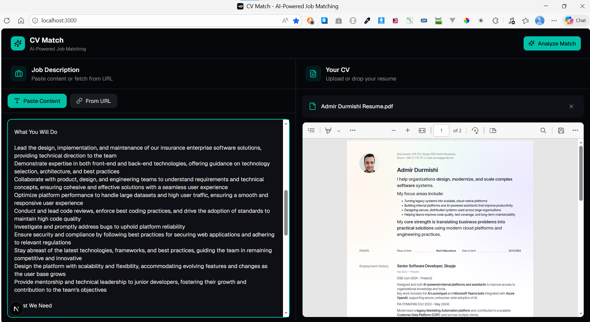

# Job Announcement CV Processor

[](https://opensource.org/licenses/MIT)
[](https://nextjs.org/)
[](https://fastapi.tiangolo.com/)
[](https://openai.com/)

An innovative AI-powered web application that revolutionizes job searching by analyzing CV compatibility with job announcements. Built to showcase cutting-edge AI integration and modern web development skills, this open-source tool empowers job seekers with data-driven insights, helping them tailor applications and boost success rates.



## 🚀 Core Idea

In today's competitive job market, matching your CV to specific job requirements can make or break your application. The Job Announcement CV Processor automates this process using advanced large language models (LLMs) to provide:

- **Instant Compatibility Scores**: Get a 0-100 match percentage at a glance.
- **Detailed Analysis**: Strengths, gaps, skill assessments, and personalized recommendations.
- **Time-Saving Insights**: Reduce manual review time and focus on what matters.

Whether you're a developer, designer, or professional, this tool demonstrates how AI can transform career advancement strategies.

## ✨ Features

- **Smart Job Fetching**: Input a job URL, and the app uses headless browsing to extract clean, relevant content.
- **Multi-Format CV Support**: Upload PDFs, DOCX files, or plain text with OCR fallback for scanned documents.
- **AI-Powered Analysis**: Leverages configurable LLMs (OpenAI, Azure, Ollama, GitHub Models) for accurate, structured reports.
- **Responsive UI**: Modern split-screen interface with dark/light themes, built for desktop and mobile.
- **Real-Time Feedback**: Visual charts and progress indicators for an engaging user experience.
- **Open-Source Ready**: Fully documented codebase for learning and contribution.

## 🛠 Tech Stack

### Frontend

- **Next.js 16**: Server-side rendering and static generation for optimal performance.
- **React 19**: Latest UI library with hooks and concurrent features.
- **TypeScript**: Type-safe development for robust code.
- **Tailwind CSS**: Utility-first styling with animations.
- **shadcn/ui**: High-quality components (buttons, forms, dialogs) based on Radix UI.
- **PDF.js**: Client-side PDF rendering and text extraction.
- **Recharts**: Data visualization for analysis results.

### Backend

- **FastAPI**: High-performance Python web framework for APIs.
- **Playwright**: Headless browser automation for reliable job page fetching.
- **LLM Integration**: Modular factory pattern supporting multiple AI providers.
- **Text Extraction**: PyMuPDF, easyocr (OCR), python-docx for versatile file handling.
- **Uvicorn**: ASGI server for production-ready deployment.

## 🏗 Architecture

The app follows a clean client-server architecture:

- **Frontend** ([src/frontend/](src/frontend/)): Handles user interactions, file uploads, and result visualization.
- **Backend** ([src/backend/](src/backend/)): Manages data processing, AI analysis, and API endpoints.
- **Communication**: RESTful APIs with CORS-enabled proxying for seamless integration.

Key workflows include fetching job content via Playwright and extracting CV text with OCR, all orchestrated through modular routes.

## 🚀 Getting Started

### Prerequisites

- Node.js 18+ and pnpm for frontend.
- Python 3.8+ with virtual environment support.
- Optional: Ollama for local AI (default), or API keys for cloud LLMs.

### Installation

1. Clone the repository:

   ```bash
   git clone https://github.com/yourusername/job-announcement-cv-processor.git
   cd job-announcement-cv-processor
   ```

2. Install backend dependencies:

   ```bash
   .\install-backend.bat
   ```

3. Install frontend dependencies:
   ```bash
   cd src/frontend
   pnpm install
   cd ..
   ```

### Running the Application

Execute the start script to launch both services:

```bash
.\start.bat
```

- Frontend: http://localhost:3000
- Backend: http://localhost:8000

The script activates the Python virtual environment and runs servers in separate terminals.

## ⚙️ Configuration

This application requires configuration through environment variables for both frontend and backend components. Create the appropriate `.env` files in the respective directories as described below.

### Backend Configuration (`src/backend/.env`)

The backend uses a `.env` file to configure LLM providers, CORS settings, and other options. Create `src/backend/.env` with the following variables:

#### Required Variables

- **`LLM_PROVIDER`**: Specifies which LLM service to use. Options:
  - `ollama` (default): Uses local Ollama instance
  - `openai`: Uses OpenAI API
  - `azure`: Uses Azure OpenAI service
  - `github`: Uses GitHub Models

#### Provider-Specific Variables

Depending on the `LLM_PROVIDER`, configure the following:

**For OpenAI (`LLM_PROVIDER=openai`):**

- `OPENAI_API_KEY`: Your OpenAI API key (required)

**For Azure OpenAI (`LLM_PROVIDER=azure`):**

- `AZURE_OPENAI_API_KEY`: Your Azure OpenAI API key (required)
- `AZURE_OPENAI_BASE_URL`: Your Azure OpenAI endpoint URL (required, e.g., `https://your-resource.openai.azure.com/openai/v1/`)

**For GitHub Models (`LLM_PROVIDER=github`):**

- `GITHUB_TOKEN`: Your GitHub personal access token with Models API access (required)

**For Ollama (`LLM_PROVIDER=ollama`):**

- `OLLAMA_BASE_URL`: Ollama server URL (default: `http://localhost:11434`)

#### Optional Variables

- **`LLM_MODEL`**: The model name to use (defaults vary by provider):
  - OpenAI/Azure: `gpt-4o`
  - GitHub: `gpt-4o-mini`
  - Ollama: `deepseek-r1:8b`
- **`DEBUG`**: Enable debug logging (`true`/`false`, default: `false`)
- **`CORS_ORIGINS`**: Comma-separated list of allowed origins (default: `http://localhost:3000,http://localhost:3001`)

#### Example `.env` Files

**Ollama (default):**

```env
LLM_PROVIDER=ollama
OLLAMA_BASE_URL=http://localhost:11434
LLM_MODEL=deepseek-r1:8b
DEBUG=false
```

**OpenAI:**

```env
LLM_PROVIDER=openai
OPENAI_API_KEY=your_openai_api_key_here
LLM_MODEL=gpt-4o
DEBUG=false
```

**Azure OpenAI:**

```env
LLM_PROVIDER=azure
AZURE_OPENAI_API_KEY=your_azure_api_key_here
AZURE_OPENAI_BASE_URL=https://your-resource.openai.azure.com/openai/v1/
LLM_MODEL=gpt-4o
DEBUG=false
```

**GitHub Models:**

```env
LLM_PROVIDER=github
GITHUB_TOKEN=your_github_token_here
LLM_MODEL=gpt-4o-mini
DEBUG=false
```

### Frontend Configuration (`src/frontend/.env.local`)

The frontend requires configuration for the backend API endpoint. Create `src/frontend/.env.local` with:

- **`NEXT_PUBLIC_BACKEND_URL`**: URL of the backend API (default: `http://localhost:8000`)

Example:

```env
NEXT_PUBLIC_BACKEND_URL=http://localhost:8000
```

### Setup Instructions

1. **For Ollama users** (recommended for local development):
   - Install Ollama from [ollama.ai](https://ollama.ai)
   - Pull a model: `ollama pull deepseek-r1:8b`
   - Use the default `.env` configuration

2. **For cloud LLM users**:
   - Obtain API keys from your provider
   - Create the appropriate `.env` file as shown above
   - Ensure your account has sufficient credits/permissions

3. **Environment Variables**:
   - Backend: Copy the example above to `src/backend/.env`
   - Frontend: Copy the example above to `src/frontend/.env.local`
   - Never commit `.env` files to version control

## 📖 Usage

1. Open the app in your browser.
2. Upload your CV (PDF, DOCX, or text).
3. Provide a job URL or paste the announcement text.
4. Click "Analyze" to receive AI-generated insights.
5. Review the match score, summary, and recommendations in the analysis panel.

For developers: Explore the main page at [src/frontend/app/page.tsx](src/frontend/app/page.tsx) to see the UI implementation.

## 🤝 Contributing

Contributions are welcome! This project is a showcase of modern development practices. To contribute:

1. Fork the repo.
2. Create a feature branch.
3. Submit a pull request with detailed changes.

Check the codebase for conventions: APIRouter in [src/backend/routes/](src/backend/routes/), shadcn/ui components in [src/frontend/components/ui/](src/frontend/components/ui/).

## 📄 License

MIT License - see [LICENSE](LICENSE) for details.

---

Built with passion to demonstrate AI and web dev expertise. Star the repo if it helps your job search! 🌟
